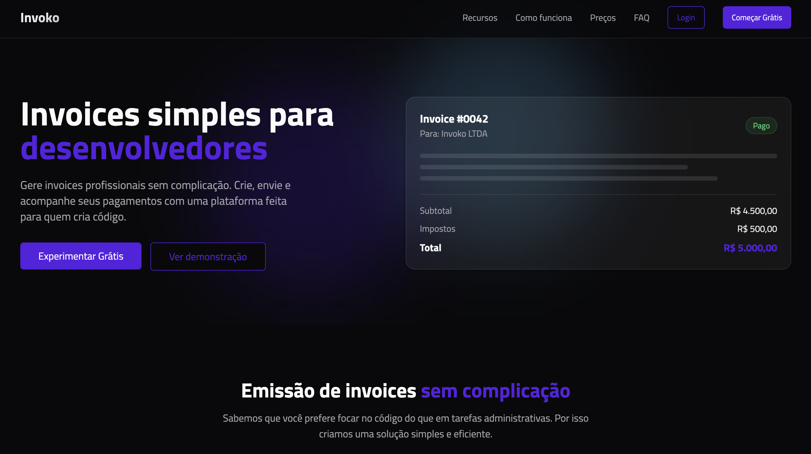

# 🧾 Invoko – Gerador de Invoices para Desenvolvedores

Crie invoices profissionais de forma simples e rápida. Pensado para freelancers, devs e pequenas equipes que querem focar no código, não na burocracia.



## ✨ Recursos

- 🎨 Modelos profissionais e personalizáveis
- 📤 Envio automático de invoices por e-mail
- 📊 Acompanhamento em tempo real de pagamentos
- 📁 Exportação em PDF
- ⚡ Interface animada com GSAP
- 💨 Estilização moderna com Tailwind CSS
- 🧱 Componentes reutilizáveis com shadcn/ui
- 🔍 Filtros e organização por status: Rascunho, Enviado, Pago
- 🔧 Integração futura com métodos de pagamento (PIX, Stripe, etc.)

## 🚀 Demonstração

> Veja a demo ao vivo: [https://invoko.com.br](https://invoko.com.br)  
> Ou experimente localmente seguindo os passos abaixo.

## 🛠️ Tecnologias

Este projeto foi desenvolvido com:

- [React](https://reactjs.org/)
- [Vite](https://vitejs.dev/)
- [TypeScript](https://www.typescriptlang.org/)
- [Tailwind CSS](https://tailwindcss.com/)
- [GSAP](https://gsap.com/)
- [shadcn/ui](https://ui.shadcn.com/)

## 📦 Instalação Local

Antes de começar, certifique-se de ter o **Node.js 18+** instalado.

### 1. Clone o projeto

```bash
git clone https://github.com/seu-usuario/invoko.git
cd invoko
```

### 2. Instale as dependências

```bash
npm install
```

### 3. Inicie o ambiente de desenvolvimento

```bash
npm run dev
```

Acesse `http://localhost:5173` no navegador.

## 📁 Estrutura de Pastas

```bash
src/
├── assets/          # Ícones, imagens, etc.
├── components/      # Componentes reutilizáveis
├── views/           # Páginas principais (Home, Invoice, etc.)
├── styles/          # Arquivos CSS (ex: tailwind.config.ts)
├── utils/           # Funções auxiliares
├── data/            # Dados mockados (sem backend ainda)
└── main.tsx         # Ponto de entrada
```

## 💡 Exemplos de uso

- Criar um invoice para serviços de desenvolvimento
- Gerar comprovantes de pagamento para clientes
- Controlar status de cobranças em projetos freelancers

## 🤔 FAQ

**🧾 O Invoko emite notas fiscais?**  
Ainda não, mas isso está no roadmap para integração futura com serviços externos.

**🎨 Posso personalizar os modelos?**  
Sim! Os modelos são personalizáveis e novos estilos estão em desenvolvimento.

**🌍 Posso cobrar clientes internacionais?**  
Sim, o app suporta múltiplas moedas manualmente por enquanto.

**🔁 É possível criar invoices recorrentes?**  
Ainda não, mas essa é uma das prioridades do roadmap.

## 📄 Licença

Este projeto está licenciado sob a [MIT License](LICENSE).

---

> Feito com 💻 por desenvolvedores que preferem codar a preencher planilhas.
